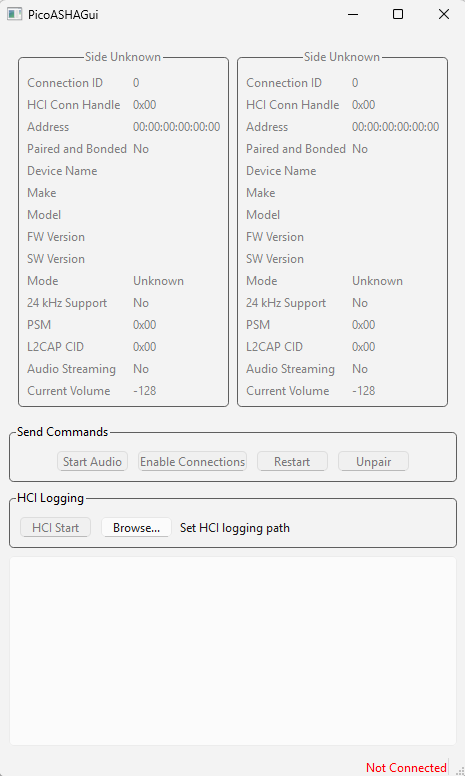
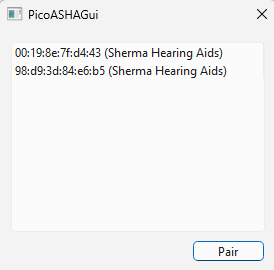
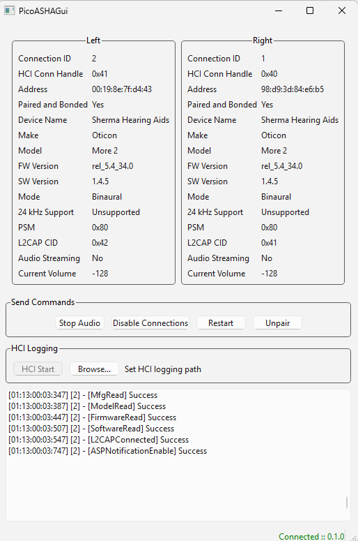

# How-to Guide

## Get microcontroller

To get started with Pico ASHA, you will need a [Raspberry Pi Pico W or Pico 2W](https://www.raspberrypi.com/products/raspberry-pi-pico/) microcontroller, 
and a micro USB cable to connect it to a computer.

These microcontrollers are cheap to purchase, and readily available.

!!! Warning

    There are unofficial clone "Pico" devices in the market. These may use a different 
    bluetooth chip, and WILL NOT work with Pico ASHA.

    Pico ASHA only supports the official Raspberry Pi Pico boards at this time.

## Download Pico ASHA firmware and software

Go do the [Download](download.md) page to download firmware and the GUI application.
    
## First start with GUI

!!! Note

    This is the recommended choice for first time users

!!! Note

    Make sure your hearing aids are not connected to other devices such as mobile phones. Otherwise 
    your hearing devices may fail to pair or connect

!!! Note

    Linux users will most likely need to belong to the `dialout` group to gain serial port permissions

To get started using the GUI, follow the following steps: 

1. Unzip the GUI application somewhere, and launch `PicoASHAGui.exe` from the `bin` folder. It should look like:
   

2. Plug the micro usb cable into the Pico, then press and hold the button labeled `BOOTSEL` while plugging 
   the other end of the cable into your computer. A 'USB drive' should appear in your file explorer

3. Copy the `UF2` file for your Pico version onto the 'USB Drive' in step `2.`. The 'USB Drive' will vanish. 
   The GUI should show a green `connected :: <version>` label in the bottom right corner

4. Put your hearing device into its bluetooth pairing mode. Consult the documentation for your hearing 
   device if you do not know how to do this.

5. The GUI should automatically show a pairing dialog listing the hearing devices it has found:
   

6. Select a hearing device in the list, and click the `Pair` button. The pair dialog will vanish while  
   pairing. If the pair is successful, the pair dialog will show again if you have a second hearing 
   device to pair

7. Once a full hearing device set has been paired, you will not have to do this again

## First start without GUI

!!! Note

    It is recommended that the GUI is used for the first time, as it can show any errors during the 
    pairing and connecting process.

!!! Note

    Make sure your hearing aids are not connected to other devices such as mobile phones. Otherwise 
    your hearing devices may fail to pair or connect

To get started without the GUI, follow the following steps:

2. Plug the micro usb cable into the Pico, then press and hold the button labeled `BOOTSEL` while plugging 
   the other end of the cable into your computer. A 'USB drive' should appear in your file explorer

3. Copy the `UF2` file for your Pico version onto the 'USB Drive' in step `2.`. The 'USB Drive' will vanish

4. After approximately 10 seconds, the automatic pairing process begins. The LED should be flashing

5. Put your hearing device into its bluetooth pairing mode. Consult the documentation for your hearing 
   device if you do not know how to do this. It is recommended you only pair one at a time

6. If you have a binaural set of hearing devices, the LED will start flashing faster when one device 
   has connected. It will turn solid when both hearing devices are connected

7. Once a full hearing device set has been paired, you will not have to do this again

## Streaming audio

Once paired, streaming audio is incredibly simple. Just select `Pico-ASHA Adapter` from your list of output 
sound devices in your OS. The OS volume control should be able to control the streaming audio volume 
in your hearing device.

## Updating firmware

You can update firmware using steps 2 & 3 from the first start instructions. Your hearing devices 
will remain paired after the firmware update.

It is recommended to also download the latest GUI application with the firmware.

## GUI Guide

!!! Note

    Linux users will most likely need to belong to the `dialout` group to gain serial port permissions

The GUI can provide some useful tools for diagnostics and limited control.

When connected to Pico ASHA which is connected to hearing devices, the GUI looks like:

### Top section

The top section shows some details about the connected hearing devices such as address, name, make, model 
etc. It also shows the current streaming volume.

This section is purely informational.

### Send Commands

You can currently send a few useful commands:

- **Stop/Start Audio**: Allows to start and stop audio streaming. Mostly useful to restart the 
audio stream if it goes out of sync.

- **Enable/Disable Connections**: Allows to disconnect the hearing devices from Pico ASHA so 
they can be connected to another device such as an Android phone.

- **Restart**: If something goes wrong, maybe restarting Pico ASHA will fix it?

- **Unpair**: Pico ASHA only supports one set of hearing devices at a time. This allows starting 
the pairing process again, potentially with a different set of hearing devices.

### HCI Logging

!!! Info
    
    You only need to do this if requested.

If are having difficulties connecting your hearing devices, I may ask that you enable HCI logging 
to provide more detailed diagnostic information.

- **Browse...**: Click this button to choose an HCI log file to create

- **HCI Start/Stop**: Click to start or stop HCI logging. Pico ASHA will restart when starting or 
stopping HCI logging. Once stopped, the HCI log file is saved to the file set above

### Log/Messages window

The bottom section contains a log window which displays informational, warning and error messages. 
I may ask for this to be copied into an issue if you have difficulties connecting or other issues.

You can right-click inside and `Select All`, then `Copy`.

## Troubleshooting

### Connection/Pairing issues

If you have problems with initial pairing or connecting, please create an [issue](https://github.com/shermp/Pico-ASHA/issues) 
describing the problem. Please copy the contents of the log window into the issue so I have a better 
idea of what the issue might be.

### Choppy/unstable audio

Choppy or unstable audio could be a sign of environmental factors such as interference. There is 
not a lot I can do about this, and some hearing devices may be more susceptible to such issues compared 
to others.

### Stereo sync issues

If the stereo audio starts going out of sync, you can stop and start the audio using the GUI commands.
